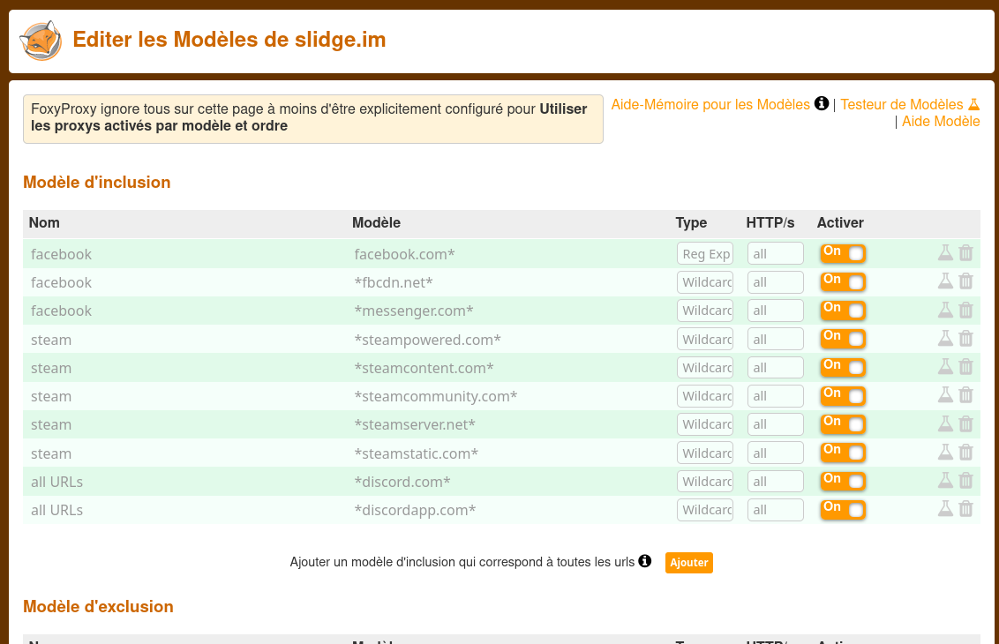

Keeping a low profile
=====================

.. note::
  None of this applies to networks that are tolerant to alternative clients, such as
  Telegram, Signal and Mattermost.

Some networks are actively fighting alternative clients such as slidge.
To prevent being detected, you should (a) activate additional security features to your legacy account, such as 2FA
and (b) establish "normal" traffic on your account, from slidge's IP.

For (b), the most convenient way is to use a proxy (a SOCKS5 proxy is pretty easy to set up in case you have
ssh access to your xmpp server) and configure your web browser to use this proxy whenever you access the web
interface of your legacy network.
For instance, I use firefox's `FoxyProxy <https://addons.mozilla.org/firefox/addon/foxyproxy-standard/>`_
and these are my rules:

