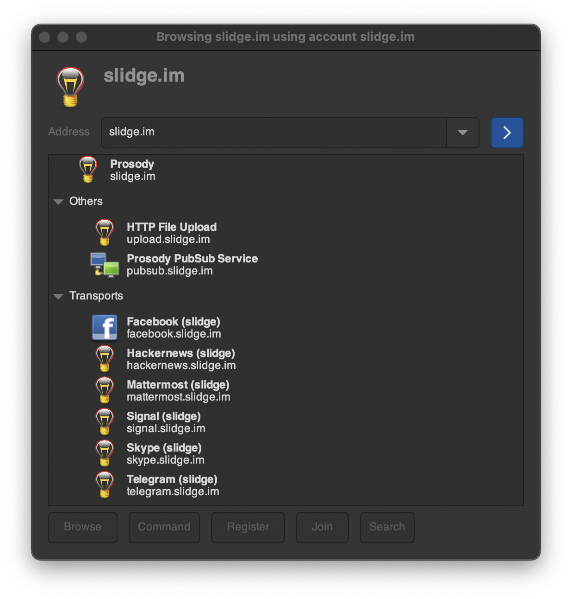
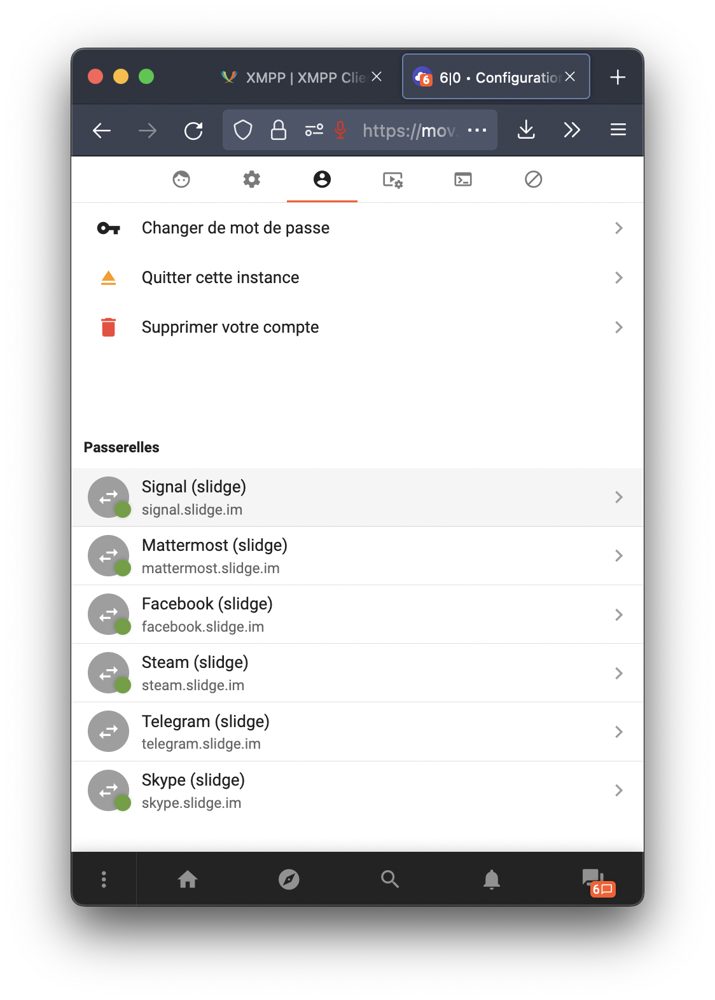
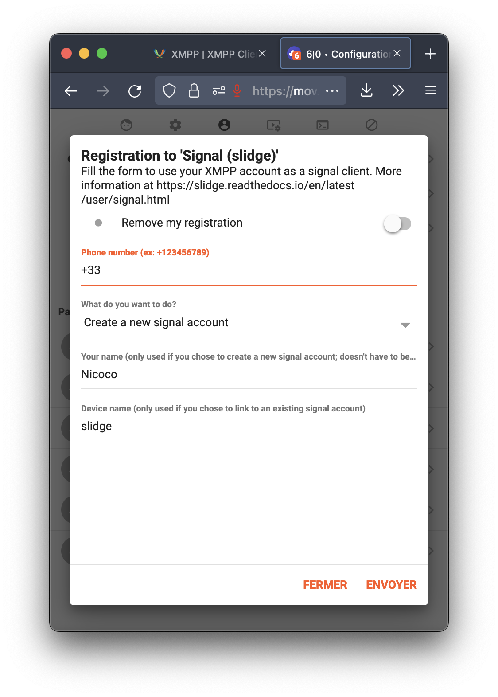

Registration
============

To make it work, you must "link" the foreign accounts you want to use with your
XMPP account by registering to the slidge server component.
This is done either via the "Register" :term:`Ad-hoc Command`
or :term:`Chatbot Command`.

.. include:: note.rst

Gajim
-----

In gajim, go to the "accounts" menu and select "discover services".

Click "Command", then "Register".

.. warning::

  Clicking on "Register" work sometimes, but it uses in-band registration
  (:xep:`0077`) which is very basic and won't work for all legacy networks.
  "Command"→"Register" should be preferred.

Movim
-----

In Movim, you can see the gateways in settings->account.

   An example registration in Movim.

Other clients
-------------

Other clients might have different UIs, but you can always fall back to the
"register" :term:`Chatbot Command`.
